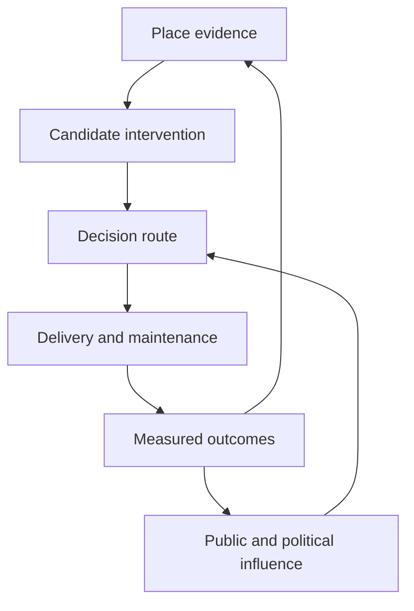
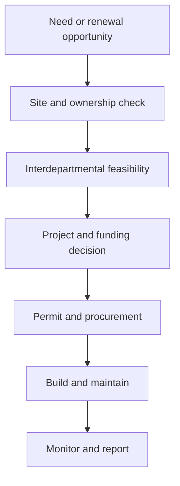

# The second map: governance and measurement

Status: researched working hypothesis, 3 October 2026. Current roles are based mainly on official Basel-Stadt sources. Proposed bodies, measures and civic structures are design ideas, not descriptions of existing authority.

## Reframed project thesis

The challenge looks like a request for a better data map. That is only half the work.

Basel also needs a map of **how evidence becomes a decision**:

- who identifies a place;
- who owns the street, square, sewer, tree or building;
- who checks feasibility and conflicts;
- who allocates space and money;
- who permits, builds and maintains the intervention;
- who measures whether it worked;
- who can demand action or challenge inaction.

The product could therefore join two maps:

The spatial canvas asks **where and what**. The governance canvas asks **who, by which route, with what evidence, and who follows up**.

## What already exists in Basel

The governance problem does not begin from zero.

- The Regierungsrat approved the Stadtklimakonzept in 2021. It is a binding planning instrument for the cantonal administration; official guidance says cantonal plans and planning/building approvals must be checked against it.
- The **Bau- und Verkehrsdepartement (BVD)** has formal lead responsibility.
- Since 2021 an interdepartmental working group led by the **Stadtgärtnerei** has worked on Schwammstadt foundations, development areas and pilots.
- The Regierungsrat mandated BVD, together with **Präsidialdepartement (PD), Departement für Wirtschaft, Soziales und Umwelt (WSU), and Gesundheitsdepartement (GD)**, to coordinate the nine Stadtklimakonzept fields.
- BVD was mandated to establish monitoring and controlling, with findings to the Regierungsrat every four years; the first delivery was scheduled for 31 July 2025. The 2023 proposal envisaged a one-time indicator report from the Statistisches Amt and four-year controlling reports.
- In November 2025 the Regierungsrat approved CHF 280,000 to scientifically monitor the VoltaNord sponge-city pilots for five years, with the explicit aim of learning whether they can be applied elsewhere in the city.
- The Grosse Rat approved CHF 9.353 million in 2024 for selected Stadtklimakonzept activities for 2025–2034, including implementation, maintenance, participation, communication, incentives and monitoring/controlling.

These facts change the question. We should not claim that nobody owns the topic. We should investigate whether the current distributed ownership produces a visible, repeatable path from evidence to action.

Key primary sources:

- [Stadtklimakonzept implementation](https://www.bs.ch/schwerpunkte/klima/stadtklima/umsetzung-stadtklimakonzept)
- [2023 Regierungsrat proposal: responsibilities, resources and monitoring](https://grosserrat.bs.ch/dokumente/100405/000000405284.pdf)
- [Parliamentary business 23.0813 and UVEK report](https://grosserrat.bs.ch/ratsbetrieb/geschaefte/200112641)
- [VoltaNord monitoring decision, 18 November 2025](https://www.bs.ch/medienmitteilungen/2025-kurzmitteilungen-aus-der-regierungsrats-sitzung-bulletin-33)
- [Basel wird Schwammstadt, 5 May 2022](https://www.bs.ch/medienmitteilungen/bvd/2022-basel-wird-schwammstadt)

## Current institutional map

| Actor | Current role relevant to sponge-city decisions | Decision Canvas question |
|---|---|---|
| Regierungsrat | Highest executive authority; approved the concept, interdepartmental coordination and projects/expenditure within its authority | Which decisions and progress reports reach government, and what action follows? |
| Grosser Rat | Legislation, larger expenditure, political mandates and oversight | Which targets, budgets and reporting duties are politically binding? |
| UVEK of the Grosser Rat | Prepares business concerning environment, nature/water protection, transport, public space, wastewater and utilities | Does the evidence allow meaningful scrutiny of delivery and effects? |
| BRK of the Grosser Rat | Prepares spatial planning, building supervision, townscape and housing matters | Are climate-adaptation requirements embedded in planning/building rules? |
| BVD / General Secretariat | Formal lead for Stadtklimakonzept coordination and monitoring/controlling | Who owns the portfolio and escalates conflicts? |
| Stadtgärtnerei | Leads the interdepartmental sponge-city work; plans, develops and maintains public green; leads/participates in pilots and tree-related research | What does vegetation need and who carries long-term maintenance? |
| Tiefbauamt | Builds/maintains streets and water infrastructure; handles wastewater and public-space works | When can a street/sewer renewal carry an intervention, and who owns runoff performance? |
| Städtebau & Architektur | Spatial planning, urban design, public space, cantonal building projects and environmental planning | At what planning gate are space and requirements secured? |
| Amt für Mobilität | Transport planning and allocation/operation of mobility functions | Which mobility, access and safety constraints compete for the same space? |
| Bau- und Gastgewerbeinspektorat | Coordinates building-permit procedures and legal compliance | Which private interventions require permits and which authorities co-assess them? |
| WSU / Amt für Umwelt und Energie | Water/soil, groundwater, contaminated sites, direct rainwater discharge and environmental law | Is infiltration or discharge legally and environmentally viable? |
| PD / Kantons- und Stadtentwicklung | Cross-department development, neighbourhood dialogue, participation and area monitoring | How are local needs and affected groups brought into the decision early? |
| Statistisches Amt | Independent official statistics, open data and commissioned monitoring | Which indicators are comparable, publishable and sustained over time? |
| Gesundheitsdepartement | Heat and health consequences; part of the mandated coordination | Where are vulnerable people exposed, and are health outcomes considered? |
| Finanzdepartement / Immobilien Basel-Stadt | Finance and the canton's property portfolio; involved in development areas and public property | Which properties and investment cycles create delivery opportunities? |
| Riehen and Bettingen | Separate municipalities with their own authority; the 2021 Basel city concept did not cover Bettingen and described Riehen as developing its own concept | What transfers across municipal borders, and what requires a separate mandate? |

Large landowners and infrastructure actors are also part of delivery. The 2023 government proposal explicitly named SBB, Deutsche Bahn, Christoph Merian Stiftung and Schweizerische Rheinhäfen as partners to approach. IWB, BVB, housing cooperatives, private owners, developers, schools and hospitals may be decisive at a specific site.

## A likely decision route to test

This is a research model, not yet a verified process description for every project type:

At each gate, the Canvas should identify:

| Gate | Required answer | Possible owner(s) |
|---|---|---|
| Opportunity | Is there a climate need, a renewal project, or both? | BVD, PD, property owner, neighbourhood |
| Site control | Who owns and operates the affected surface and infrastructure? | TBA, IBS, municipality, private/institutional owner |
| Feasibility | What is known about soil, groundwater, utilities, access, mobility, ecology and maintenance? | STG, TBA, S&A, Mobility, AUE, BGI, operators |
| Prioritisation | Why this site before another, and which benefits/trade-offs count? | BVD-led coordination; political mandate where required |
| Funding | Which budget, project credit, Mehrwertabgabefonds or owner contribution applies? | Department, Regierungsrat or Grosser Rat depending on authority |
| Permission | Which plans, permits, environmental approvals and participation duties apply? | BGI and co-assessing authorities |
| Delivery | Who designs, contracts, constructs and accepts the work? | Project owner and delivery offices |
| Stewardship | Who waters, cleans, repairs, inspects and pays for the asset over its life? | STG, TBA, property owner or contracted operator |
| Learning | What was measured, what worked, what failed, and what becomes a new standard? | Project owner, Statistisches Amt/research partner, BVD coordination |

The research should test whether project information currently survives these hand-offs. The most important governance dataset may be a **decision and opportunity register**, not another hazard layer.

## Candidate data gaps

“Missing” must be used carefully. Some of this information may exist inside an office but not be public, spatially joinable, current or available early enough for a decision.

### 1. Site feasibility

- fine-scale surface material and sealed/unsealed status;
- soil structure, infiltration tests and compaction;
- groundwater constraints and contaminated-site information;
- microtopography, kerbs, inlets and real exceedance flow paths;
- underground utilities and space available for roots/storage;
- sewer capacity and connections where disclosure is safe;
- ownership, operating responsibility and access rights;
- road functions, emergency access, loading, parking and accessibility;
- maintenance access, capacity and expected whole-life cost.

### 2. Need and exposure

- observed near-ground day and night heat at human scale, not only modelled heat;
- where children, older people, outdoor workers and medically vulnerable people spend time, with privacy-preserving aggregation;
- pedestrian use, waiting areas, routes to schools/care and access to cool spaces;
- tree vitality, root volume, soil moisture and actual drought stress;
- private courtyards/roofs and institutional land that could contribute;
- combined heat–runoff–social vulnerability, without collapsing the dimensions into one opaque score.

### 3. Delivery opportunity

- the forward street, sewer, tram, utility and public-building renewal pipeline;
- the exact decision gate and deadline for influencing each project;
- climate measures considered, accepted, rejected or deferred—and why;
- budget source, capital cost, maintenance obligation and delivery status;
- permits, dependencies, conflicts and responsible person/office.

### 4. Outcomes and accountability

- a geospatial inventory of completed interventions and their design parameters;
- consistent before/after and comparator data;
- rainfall retained, reused or delayed; overflow/peak-flow behaviour;
- soil moisture, tree survival/growth and irrigation demand;
- surface and air-temperature effects, shade and outdoor comfort;
- maintenance effort, failures, clogging, repair and lifecycle cost;
- who benefits and whether heat-vulnerable areas receive investment;
- published progress against Stadtklimakonzept commitments.

A targeted public search for this note did not surface the indicator/controlling report that the 2023 proposal scheduled for 31 July 2025. That does **not** prove it was not delivered; locating it, requesting it or confirming its status is a concrete research task.

## Measurement plan

### Stage 0 — audit before adding sensors

1. Build a source register: owner, licence/access class, spatial unit, update cycle, quality, scenario year and known limitations.
2. Interview the offices that produce and use each source. Ask what exists internally, what is missing, and what arrives too late for decisions.
3. Map the active project pipeline and decision deadlines.
4. Define the decisions the measurement must improve. Do not collect data merely because it is measurable.

### Stage 1 — define a common intervention record

Every pilot or completed intervention should have:

- stable site/intervention ID and geometry;
- design intent and mechanisms (absorb, store, slow, sweat, shade, cool);
- baseline, expected effect and explicit uncertainties;
- responsible project owner and maintenance owner;
- construction date, costs and maintenance plan;
- measurement protocol, raw-data references and quality notes;
- decision history: alternatives, conflicts, reasons and approvals.

### Stage 2 — instrument representative pilots

Use VoltaNord as an obvious learning source, then add a comparator and at least one retrofit context. Not every location needs a sensor network.

Possible measurements:

| Question | Measurement approach | Important control |
|---|---|---|
| How much rain arrived? | Calibrated rainfall data; local gauge where spatial variability matters | Compare with MeteoSwiss/reference station and document gaps |
| Where did water go? | Inflow/outflow or water-level logging, overflow event logs, periodic infiltration tests | Known contributing area and bypass/overflow routes |
| Did storage persist too long or drain too fast? | Water-level recession and soil-moisture profiles | Sensor depth, soil heterogeneity and maintenance events |
| Did vegetation benefit? | Soil moisture, irrigation records, tree vitality/growth and survival | Species, planting size, season and comparable trees |
| Was it cooler? | Shielded, calibrated air-temperature/humidity loggers plus surface-temperature observations | Shaded/unshaded comparator; radiation bias; same weather periods |
| Did people benefit? | Shade mapping, observation and short user surveys | Time of day, season, accessibility and representation |
| Is it maintainable? | Structured maintenance, clogging, repair, labour and cost logs | Consistent definitions and whole-life accounting |

[Recent Swiss research on low-cost urban heat networks](https://arxiv.org/abs/2606.09364) reinforces that calibration and radiation shielding matter; uncorrected devices can bias urban heat estimates. Measurement design should be reviewed by an appropriate research partner.

### Stage 3 — scale through cheap, repeatable indicators

- periodic LiDAR/aerial imagery for canopy and surface change;
- open project/intervention register with status and decision provenance;
- annual delivery indicators, separated from four-year outcome evaluation;
- representative intensive pilots rather than pretending every site is fully measured;
- a public dashboard that links each aggregate back to evidence and limitations.

## Who should decide?

Basel already has the legal authorities. A new body should not become a shadow permit office or replace the Regierungsrat/Grosser Rat.

The useful addition would be a **Schwammstadt Portfolio Board** inside the existing mandate:

- chaired by the BVD as formal lead, with WSU/AUE as deputy on water/environment;
- standing members from Stadtgärtnerei, Tiefbauamt, Städtebau & Architektur, Mobilität, AUE, PD/Kantons- und Stadtentwicklung, Statistisches Amt, GD and FD/Immobilien Basel-Stadt;
- Riehen/Bettingen and infrastructure/land owners included when the geography requires it;
- owns the citywide opportunity/project register, common evidence standard and pilot portfolio;
- resolves or escalates cross-office conflicts early;
- recommends priorities and funding but leaves statutory decisions with the competent authority;
- publishes a decision log, progress indicators, unresolved barriers and outcome reviews.

An external advisory panel could include neighbourhood representation, applied research, environment/health/accessibility groups, major owners and the professions. It should advise and challenge, not approve permits.

## Public and political influence map

### Formal routes

- neighbourhood participation under §55 of the Basel-Stadt constitution and the participation ordinance;
- consultation procedures for proposals of general significance;
- petitions, parliamentary motions/Anzüge/interpellations and committee scrutiny;
- cantonal popular initiatives and referenda;
- objections/appeals where planning or building law grants standing;
- participation attached to specific streets, squares and development areas.

[The cantonal participation page](https://www.bs.ch/pd/kantons-und-stadtentwicklung/stadtteile/partizipation) identifies the Stadtteilentwicklung office as the participation contact and explains the current basis in §55 and the 2007 ordinance. It also says the newer 2023 participation law is not yet in force. This existing route should be designed into the Canvas rather than replaced by an app feedback button.

### Actors able to mobilise or block

The stakeholder map should include both likely supporters and actors carrying legitimate trade-offs:

- neutral neighbourhood associations, Quartiertreffpunkte and affected residents;
- umverkehR, which organised the Basel Stadtklima initiatives; Pro Natura Basel and WWF Region Basel; other mobility/environment associations to verify;
- older people, health, disability/accessibility, children/youth and outdoor-worker representatives;
- tenants, housing cooperatives, homeowners and institutional landowners;
- Gewerbe, retail, logistics, gastronomy and emergency/access interests;
- planning, landscape architecture, civil engineering and maintenance professions;
- IWB, BVB, SBB, DB and Schweizerische Rheinhäfen;
- universities and applied-science partners;
- media and civic-data communities.

The rejected 2023 Gute-Luft and Zukunft initiatives are useful evidence: citizen mobilisation around street space already exists, but any durable coalition must work through the conflicts among greenery, mobility, access, commerce and cost rather than assuming a uniform public interest.

## Who should receive a brief?

Use a non-partisan evidence brief, not separate messages tailored to presumed allies.

### Executive first ring

- **Esther Keller**, head of BVD: department with formal lead responsibility.
- **Kaspar Sutter**, head of WSU: AUE, water/soil/groundwater and environmental execution.
- **Conradin Cramer**, head of PD: cross-department development, neighbourhood participation and official statistics.
- **Lukas Engelberger**, head of GD: heat as a health risk and vulnerable populations.
- **Tanja Soland**, head of FD: finance and the cantonal property portfolio where relevant.

### Parliamentary first ring

- **Raffaela Hanauer**, president of UVEK, followed by the full UVEK so the issue is not framed as a single-party project. UVEK formally covers environment, water protection, transport, public space, wastewater and utilities.
- **Michael Hug**, president of BRK, and the BRK where planning/building rules or major spatial plans are implicated.
- Finance Commission when the proposal moves from analysis into recurring delivery and maintenance resources.

Membership changes, so the app/research file should link to the live [UVEK](https://grosserrat.bs.ch/gremien/sachkommissionen/umwelt-verkehr-energie) and [BRK](https://grosserrat.bs.ch/gremien/sachkommissionen/bau-raumplanung) pages instead of hard-coding all members.

The first brief should ask for facts before asking for a new programme:

1. Where is the first Stadtklimakonzept indicator/controlling report?
2. What exactly does VoltaNord monitor, and when will interim findings be usable?
3. Which project pipeline is screened for sponge-city opportunities, at which gate?
4. Which opportunities were rejected or lost, and for what recurring reasons?
5. Who owns the cross-department outcome and public reporting?

## Should there be a Verein?

Possibly—but only if it fills a role that existing organisations do not.

A useful **Verein Schwammstadt Basel** would be an independent civic observatory and convenor, not another awareness campaign. Its possible mandate:

- maintain a public implementation and evidence tracker;
- publish an annual “where water meets decisions” scorecard;
- help neighbourhoods turn observations into evidence-backed site proposals;
- coordinate citizen science under a quality protocol;
- convene environment, health, accessibility, housing, mobility and business voices;
- follow projects through the decision pipeline and explain delays/trade-offs;
- request and translate public records without claiming technical authority.

Governance safeguards should include transparent funding, declared interests, published methods, a multi-stakeholder board, an independent scientific/method panel, privacy rules and a clear correction process.

Before founding anything, test whether this function could be hosted by an existing coalition: umverkehR has mobilisation experience; Pro Natura Basel and WWF Region Basel have nature/stadtklima expertise; the canton already supports neighbourhood organisations; the national [Schwammstadt information platform](https://sponge-city.info/) provides professional knowledge. A new Verein is justified only if continuous cross-topic accountability and the data-to-decision map remain ownerless.

## Examples worth learning from

| Example | Useful institutional pattern | What not to assume |
|---|---|---|
| [Berliner Regenwasseragentur](https://regenwasseragentur.berlin/) | Joint initiative of the Berlin Senate and water utility; a durable translation/advice node for decentralised rainwater management | An agency alone does not confer permitting or budget authority |
| [Rotterdam Weatherwise programme framework](https://rotterdamsweerwoord.nl/content/uploads/2023/06/RWW_Programmakader-2030_ENG.pdf) | City programme connecting residents, businesses, community organisations and public authorities; links climate urgency with implementation opportunities | Governance, water institutions and finance differ from Basel |
| Basel VoltaNord pilots | Five-year scientific accompaniment intended to support transfer to the wider city | Results are not yet equivalent to citywide proof |
| [Basel Superblock evaluation](https://www.bs.ch/medienmitteilungen/pd/2026-abschluss-der-superblock-tests-und-weiteres-vorgehen) | Local “city as laboratory” precedent combining surveys, indicator monitoring, counts and stakeholder interviews before a Regierungsrat decision | It evaluates a different intervention and cannot supply hydrological evidence |
| Basel §55 neighbourhood participation | A legal route for affected neighbourhood voices and existing intermediary organisations | Participation is not the same as final decision authority |
| umverkehR Stadtklima initiatives | Demonstrates issue framing, coalition-building and direct-democratic mobilisation | Both Basel initiatives were rejected in 2023; their targets are not an adopted mandate |

## Research workstream

### A. Reconstruct the real process

- Select one completed project, one active project and one missed opportunity.
- Interview each hand-off from problem identification through maintenance.
- Record decision rights, documents, timelines, evidence and failure points.
- Compare the actual route with the proposed gate model above.

### B. Audit current governance promises

- Locate the 2025 indicator/controlling report or confirm its status.
- Obtain the current composition and mandate of the interdepartmental Schwammstadt working group.
- Establish what the VoltaNord monitoring measures and its publication schedule.
- Verify progress on all nine Stadtklimakonzept fields, especially internal responsibility, owner partnerships and incentives.

### C. Map influence

- Analyse relevant parliamentary business since 2021 and voting/committee routes.
- Interview UVEK/BRK representatives across parties.
- Map neighbourhood, environmental, health/accessibility, property, business and infrastructure interests.
- Identify which groups are missing from current participation.

### D. Design the accountability layer

- Prototype a project/decision record linked to the spatial Place Profile.
- Test an annual scorecard with government, parliamentary and neighbourhood users.
- Decide whether the accountability function belongs inside government, an existing civic organisation, a new Verein, or a paired inside/outside model.

## Stronger one-sentence proposition

> **Basel does not only need a map of where sponge-city interventions could work; it needs a map of how those places become decisions, who owns every hand-off, what evidence is still missing, and who can hold the process accountable.**
