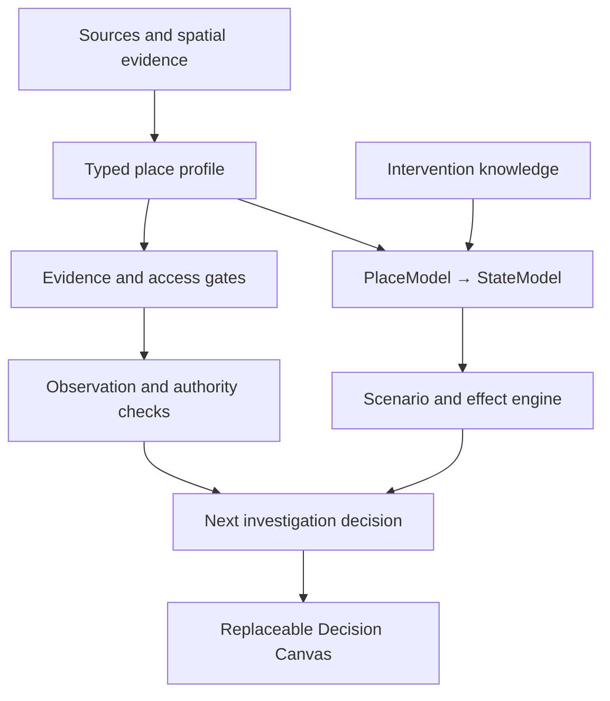

# Post-hackathon architecture

A place is the shared context. Evidence is the shared backbone. Views and specialist engines remain replaceable modules.

## Current runnable composition

`journey/modules.json` declares bounded module roles. `journey/context.mjs` carries identity and investigation questions into Street X-Ray, Rain Walk and Street Lab. `scripts/build.mjs` assembles one static application. The view reads source-pinned street profiles; it does not own facts or calculate hidden scores.

Kanonengasse is the default because its profile is computed from spatial source snapshots. Klybeck remains the earlier illustration with a deterministic Connected Case. They are not presented at the same evidence level. The generic street drawing is labelled schematic for both.

The original atlas is canonical in `data/` and `solutions/`; the imported wrapper copy is not kept as a competing source. The state engine is canonical in `adaptive-interface/`. Typed contracts live beside the modules that own them.

| Boundary | Payload now | May not transfer |
| --- | --- | --- |
| Sources → street profile | Claims, source links, methods, permitted uses, access states, unresolved checks | Unknowns disguised as numeric observations |
| Decision Canvas → Street X-Ray | Declared street-profile key | Inferred geometry or authority answers |
| Decision Canvas → Rain Walk | Investigation ID and display name | Surveyed geometry, hydraulic parameters or shared review authority |
| Decision Canvas → Street Lab | `candidate-site-context/v1`: identity, source leads, constraints, missing-data questions | Fixture scores, site geometry, retention performance or soil rates |
| Profile → investigation export | Source SHA-256, claims, gates, gatekeepers, next actions, `requires-investigation` | Approval or a construction recommendation |
| PlaceProvider → adaptive engine | `adaptive-place/0.1` (learning fixture today) | Raw GIS field names or implicit drainage assumptions |
| Andy adapter → future PlaceProvider | Tellplatz source records with place/time/metric provenance | Tellplatz LST transferred to another site, air temperature or game effect estimates |

## Stable computational seams

The adaptive runtime owns three immutable layers: provider source, corrected baseline and intervention scenario. Interventions compile into state operations; effects emerge from state under a scenario. Routing is evidence. The renderer consumes the view and emits bounded actions.

Street Lab is a second, specialist water-learning model with its own conservation checks. It is not silently fused with the adaptive qualitative engine. The two can be connected later through an explicit state adapter and a declared parameter/evidence contract.

The spatial graph and DataFit remain external reusable substrates, rather than codebases forced into this repository. A future PlaceProvider may consume their outputs through the existing typed model.

## Next seams to implement

1. A real PlaceProvider for one surveyed Basel segment: geometry, elements, source fingerprints and unresolved context. Do not turn aggregate land-cover areas into invented element geometry.
2. A scenario adapter that carries only validated site parameters into the water engine. Unsupported effects stay unknown.
3. Observation import and review that keeps contributor reports, independent verification and authority answers distinct.
4. Andy's Tellplatz evidence adapter under its own place/time identity, after testing source compatibility.
5. Governed delivery through Weavr once a project/mission envelope is explicitly established. This document is design evidence, not a mission dispatch.
