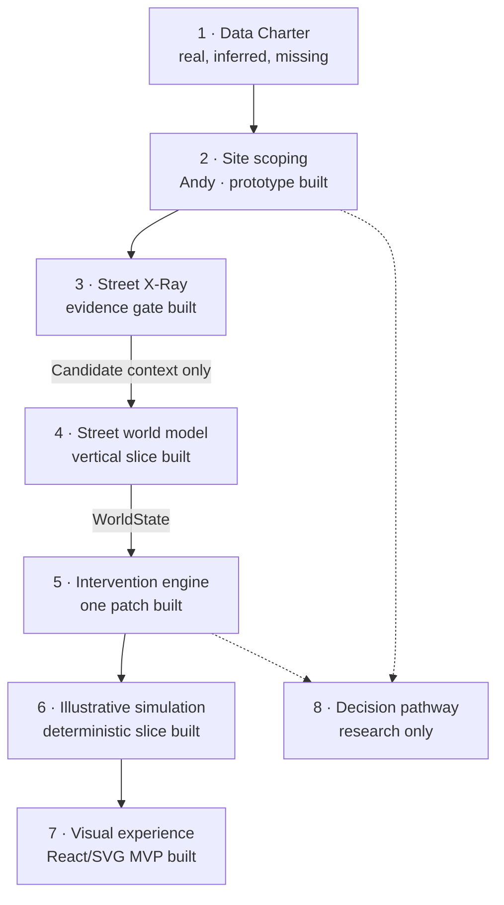
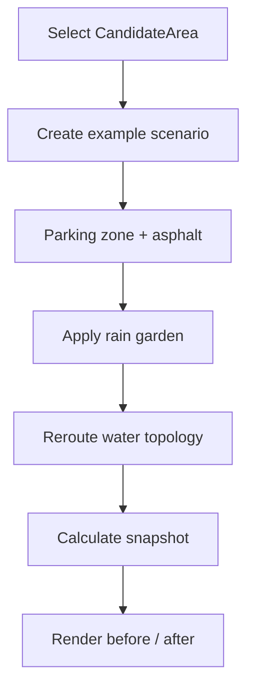

# SpongeSquad architecture and build status

See also [Product vision](PRODUCT_VISION.md), [MVP boundary](MVP.md), [data-gap-to-decision TODO](TODO-DATA-GAP-TO-DECISION.md), [PR 3 sparring review](PR3-SPARRING.md) and the [architecture decision records](adr/README.md).

## Product spine

The project is not one game or one map. It is a sequence of questions:

```text
FIND
Where in Basel should we investigate?
  ↓
UNDERSTAND
What is actually present at the selected site?
  ↓
DESIGN
What can change, and which measures depend on one another?
  ↓
TEST
How might water, heat and sewer load respond?
  ↓
SEE
Make the changed street system visible and explorable.
  ↓
DECIDE
Who can act, what evidence is required, and how does a proposal advance?
```

## System modules



| Module | Purpose | Current state | Remaining work |
| --- | --- | --- | --- |
| Evidence charter and gap engine | State what should exist, what Basel publishes and what can be inferred | Ported Data Charter with 25 indicators, frozen/live inputs, four inference pilots with typed claims (class, method, inputs, resolution, validation, limitations, permitted use) and explicit missing-data asks | Validate claims before any use beyond explain/screen; agree a handoff v2 before claims enter a site scenario (ADR 0007) |
| Evidence discovery | Find relevant Basel datasets | Basel-Stadt and opendata.swiss connectors, source registry and metadata model exist in Andy's `feature/hot-spot-map` branch | Verify dataset IDs, schemas, licences, temporal coverage and spatial extent |
| Site scoping | Identify places worth investigating | React/Leaflet map, `CandidateArea`, indicators, scoring, shortlist and comparison exist | Replace illustrative pins and values with spatially derived evidence |
| Street X-Ray | Separate available context, limited hypotheses and decision-blocking gaps | One Klybeck study point, three evidence layers, verification rehearsal and printable Evidence Passport | Replace the illustrative segment with a surveyed segment and attach actual gatekeeper responses |
| Scenario adapter | Translate an area into a street case | Versioned candidate-context handoff implemented on `integration/spatial-journey` | Replace the illustrative context only when verified street-scale inputs exist |
| Street world | Describe what physically exists | Minimal typed street with zones, surfaces, assets, nodes and connections | Add verified site input only through a scenario-seed contract |
| Intervention engine | Describe what changes | Reversible rain-garden and runoff-connection patch | Add measures only when they demonstrate a new dependency or trade-off |
| Simulation | Explain directional effects | Pure deterministic water balance plus driver-bearing mechanism claims, independent of rendering | Keep exact volumes illustrative until a calibrated model and suitable inputs exist |
| Application shell | Navigation, evidence and controls | Site scoping → Street Lab transition, journey markers and candidate evidence panel implemented | Add presentation/explainer transition when that workstream exposes a stable entry point |
| Renderer | Make the world state visible | Accessible React/SVG renderer consumes `WorldState` and `SimulationSnapshot` | Improve explanatory sequencing and visual polish without moving rules into the view |
| Decision pathway | Explain who can act and how | Basel-specific research direction exists | Model ownership, actors, approvals, evidence gates and public influence |
| Persistence/backend | Save and share scenarios | Not implemented and not yet required | Add only when shared scenarios or server-side processing justify it |

## Existing work

### Site scoping — FIND

Andy's `feature/hot-spot-map` branch currently provides:

- Vite, React and TypeScript;
- a Leaflet Basel map;
- Basel-Stadt and opendata.swiss catalogue connectors;
- typed dataset metadata and source records;
- candidate areas with evidence, constraints and missing-data fields;
- an explainable provisional scoring function;
- local shortlisting and comparison.

The branch explicitly defines itself as an internal scoping workspace, not a validated hazard map or engineering model. Candidate-area values remain illustrative until official spatial data is joined and checked.

### Sponge Street explainer — UNDERSTAND

This fork's `feature/sponge-street-explainer` branch provides:

- a standalone street-section experience;
- seven intervention tracks;
- twelve guided transformation states;
- dependencies and system combinations;
- rainfall variants;
- an illustrative water/heat model;
- a deterministic smoke test.

Its domain logic is still embedded in the standalone prototype and must later be separated from presentation.

### Phaser prototype — prior SEE exploration

The Phaser v5 experiment provides:

- four visual zones: apartment, sidewalk, street and parking;
- eight selectable interventions;
- mild, heat and heavy-rain modes;
- animated weather and shallow surface water;
- coherent image slices from one master scene.

Its current intervention values and calculations are owned by the Phaser scene. It remains useful visual exploration, but is not the MVP runtime. [ADR 0003](adr/0003-use-react-svg-for-the-mvp-renderer.md) records the decision to use a React/SVG projection of typed state instead.

## Domain boundary

Andy's site-scoping model answers:

> Where might a heat-and-water intervention be worth investigating?

The street-world model answers:

> What is physically and hydrologically present in the selected example street?

The intervention layer answers:

> What changes, what must connect, and what trade-offs or dependencies appear?

The renderer answers:

> How can a person see and manipulate that state?

These responsibilities should remain separate.

## Core contracts

```text
CandidateSite
    ↓
StreetScenarioSeed
    ↓
WorldModel
    ↓
InterventionPlan
    ↓
WorldState
    ├── SimulationSnapshot
    └── Renderer
```

### Candidate site

The input from Andy's scoping layer should preserve evidence and uncertainty:

```ts
interface CandidateSite {
  id: string;
  name: string;
  district: string;
  coordinates: [number, number];
  indicators: {
    heat: number;
    canopyDeficit: number;
    sealedSurface: number;
    runoff: number;
  };
  directions: string[];
  constraints: string[];
  evidence: {
    confidence: "low" | "medium" | "high";
    sources: string[];
    missingData: string[];
  };
}
```

The first integration seam should be a single mapper:

```ts
function candidateAreaToScenarioSeed(
  area: CandidateArea
): StreetScenarioSeed
```

The mapper may create a clearly labelled example scenario. It must not turn provisional area indicators into measured street-level facts.

## Street-world primitives

Use five primitives only where the first vertical slice proves that they are useful.

### 1. Zones

Urban spaces in which things can occur:

```text
building · frontage · sidewalk · verge · parking · road · median · courtyard
```

### 2. Surfaces

The material state of a zone:

```text
asphalt · concrete · soil · vegetation · permeable paving
```

A parking zone remains a parking zone when its surface changes. This keeps land use separate from material performance.

### 3. Assets

Visible or functional objects:

```text
tree · building · gutter · drain · downpipe · rain garden · bench
```

### 4. Hydrological nodes

Water-system semantics independent of visual objects:

```text
catchment · storage · infiltration · conveyance · sewer
```

A rain garden can therefore be both a visible asset and a combination of storage and infiltration nodes.

### 5. Connections

The topology that makes separate measures into a functioning sponge system.

Baseline:

```text
roof → downpipe → road → drain → sewer
```

After intervention:

```text
roof → downpipe → rain garden → soil
                           └── overflow → sewer
```

## Interventions are patches

An intervention should not be a Phaser class or a picture. It should describe a transformation of the world.

```ts
const rainGarden: Intervention = {
  id: "rain-garden",
  applicableTo: { zoneKinds: ["parking", "verge"] },
  changes: [
    { type: "replaceSurface", from: "asphalt", to: "vegetated-soil" },
    { type: "addAsset", asset: "rain-garden" },
    { type: "addHydroNode", node: "storage" },
    {
      type: "reroute",
      from: "road-runoff",
      via: "rain-garden",
      overflowTo: "sewer"
    }
  ]
};
```

This lets the existing dependency and combination concepts evolve into explicit topology changes.

## First vertical slice

Do not manufacture the complete framework. Prove one end-to-end case:



The first implementation should contain only:

1. one selected `CandidateArea`;
2. one parking zone;
3. one asphalt surface;
4. one drain-to-sewer connection;
5. one rain-garden patch;
6. one changed water path;
7. one deterministic before/after snapshot;
8. one visible transformation;
9. tests showing that the patch changes topology and reduces illustrative runoff.

## Next increments

After the first slice works:

1. connect roof, downpipe and rain garden;
2. add tree-trench and soil-volume dependencies;
3. add permeable surfaces;
4. add intervention combinations;
5. expose evidence and missing data beside the scenario;
6. add actor and ownership information;
7. save and compare scenarios;
8. replace placeholders with real spatial inputs;
9. introduce a backend only when persistence or server-side analysis requires it.

## Evidence and model boundary

Until calibrated hydrology and validated site data are connected, every result remains explanatory and directional.

The system must preserve these distinctions:

- candidate relevance is not site suitability;
- catalogue relevance is not structural compatibility;
- a possible intervention is not an engineering recommendation;
- missing evidence remains visible;
- unknown never silently becomes good;
- simulation values remain labelled illustrative;
- sources, transformations and assumptions travel with the result.

## Deliberate non-goals for the hackathon slice

Do not build yet:

- a complete city ontology;
- a generic simulation platform;
- calibrated hydraulic or thermal claims;
- a database, accounts or authentication;
- every intervention at once;
- automatic recommendations from placeholder scores;
- a renderer-specific domain model.

## Immediate finish line

> Select one provisional Basel site, instantiate one small example street, apply one intervention, and visibly explain what changed physically, hydrologically and evidentially.
