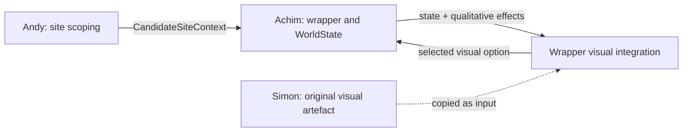

> Historical hackathon document, preserved from the team repository. Current setup: [README](../../README.md) and [post-hackathon architecture](../../docs/POST-HACKATHON-ARCHITECTURE.md).

# Component ownership and integration seam

The workstreams meet through contracts, not shared UI internals.

## Andy — place evidence and prioritisation

- Owns the Basel site-scoping tool, candidate locations, data audit, and the evidence needed to decide which place merits investigation.
- Publishes a bounded candidate context: identity, geometry or selection, known signals, provenance, and unknowns.
- Does not need to know how the street renderer draws an intervention.

## Achim — integration, state semantics, and evidence discipline

- Owns `wrapper/`, its build, WorldState contracts, intervention runtime, scenarios, effect engine, and evidence or unknown handling.
- Owns `wrapper/frontend/v1/`, the deployable integration copy of Simon's visual artefact.
- Translates supported UI selections into canonical interventions and returns a state projection plus qualitative effects.
- Refuses to turn an unsupported visual concept into a fake numeric prediction.

## Simon — original visual artefact

- Owns the original layered street artwork and interaction in `frontend/v1/`.
- Those files stay untouched by the integration PR.
- Future Simon changes can be deliberately copied into the wrapper integration after review; the website does not read his folder at build time.

## Current bridge

`wrapper/frontend/v1/worldstate-adapter.js` is the explicit anti-corruption layer between the visual vocabulary and the canonical intervention catalogue.

- Exact: green roof.
- Partial projection: combined sidewalk artwork → tree trench; native habitat → a 20 m² depaving intervention.
- Visual concept only: blue-green roof, permeable carriageway surfaces, constructed wetland, retention ponds, and floodable park. These remain selectable, but the interface says that no exact executable WorldState recipe exists yet.

The current place is the synthetic demo fixture. Andy's real candidate context can replace that provider later without changing the visual renderer.
