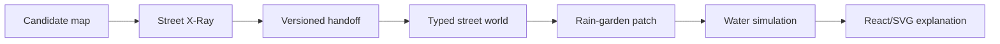

> Historical hackathon document, preserved from the team repository. Current setup: [README](../../README.md) and [post-hackathon architecture](../../docs/POST-HACKATHON-ARCHITECTURE.md).

# End-to-end MVP

## Goal

Deliver one complete, understandable journey before adding breadth:

> Select one provisional Basel candidate, inspect what is known and blocked, carry only its bounded context into an illustrative street, apply and connect one rain garden, run one storm and explain what changed.

## Implemented vertical slice

| Capability | Status | Evidence |
| --- | --- | --- |
| Candidate selection | Working | Andy's map snapshot under `data/site-scoping-tool` |
| City-wide data gaps | Working | Data Charter distinguishes open, partial, restricted and missing inputs, with inferred layers kept separate |
| Evidence-aware handoff | Working | `candidate-site-context.v1.schema.json` and runtime validation |
| Street evidence gate | Working | Three-layer Street X-Ray, typed claims, decision blockers and Evidence Passport |
| Example street | Working | Typed zones, surfaces, assets, nodes and connections |
| Intervention | Working | Deterministic rain-garden and connection patch |
| Simulation | Working | Minute-based mass-conserving illustrative water balance |
| Explanation | Working | Accessible React/SVG renderer plus HTML controls and comparison |
| Claim transparency | Working | Mechanism cards expose active state, evidence class and state drivers |
| Data readiness | Working | Basel source prospects and the routing gap are visible in-product |
| Verification | Working | Handoff, topology, immutability and conservation tests |
| Real site calibration | Not claimed | Candidate values and street remain illustrative |

## Demo script

1. Open site scoping and choose a candidate.
2. Read its sources, constraints and missing evidence.
3. Select **Explore in Street Lab**.
4. Point out that the candidate context travelled, while the street is still labelled synthetic.
5. Run rain on the sealed baseline: all water reaches the sewer.
6. Add a rain garden: rainfall on the garden itself is retained, but street runoff bypasses it.
7. Connect street runoff: the route changes to garden → soil, with overflow → sewer.
8. Compare the same storm and minute before and after.
9. End on model boundaries and the evidence still required for a real site.

## Acceptance criteria

- Both apps start with `npm run dev`.
- The selected candidate survives the transition without server state.
- Unknown or malformed handoff versions are rejected safely.
- The scenario behaves identically with and without candidate context.
- Intervention removal restores the exact baseline.
- Rain volume is conserved at every simulation frame.
- The UI remains usable without animation and supports keyboard zone selection.
- Production builds generate one static deployable folder.

## Next, in order

1. Replace provisional candidate fixtures with one prepared, provenance-bearing Basel dataset slice.
2. Define `StreetScenarioSeed v1` for verified site geometry and assets while preserving unknown routing.
3. Add a stable explainer/story destination when Bala and Mary expose their entry points.
4. Add a second intervention only when it proves a new dependency or trade-off.

Do not add a backend, generic graph framework, calibrated engineering claims or a broad intervention catalogue before the vertical slice is demo-ready.
