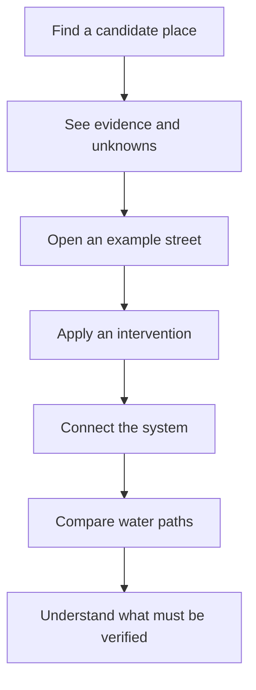

> Historical hackathon document, preserved from the team repository. Current setup: [README](../../README.md) and [post-hackathon architecture](../../docs/POST-HACKATHON-ARCHITECTURE.md).

# Product vision: from sponge principle to site-specific exploration

## The experience

SpongeSquad should make one idea tangible:

> A city becomes more sponge-like when surfaces, planting, storage, soil and drainage are designed as one connected system.

The first experience is explanatory. A person changes a familiar street, connects runoff to a rain garden and follows where the water goes. The interaction should make dependencies visible: adding a green object is not enough if water cannot reach it, storage is finite and overflow still needs a safe path.

The longer-term product connects that explanatory interface to verified spatial data. A selected Basel location can then supply real context—surface types, heat exposure, canopy, runoff evidence, public space, ownership or known constraints—without changing the core interaction pattern.

## User journey



The MVP currently proves this journey with an illustrative street. It transfers candidate identity and evidence prompts from the map, but it does not pretend that a district score contains surveyed street geometry or engineering parameters.

## Product layers

| Layer | Question | Current MVP | Future source |
| --- | --- | --- | --- |
| Evidence | What is known here? | Candidate sources, gaps and constraints | Basel APIs, prepared datasets, field evidence |
| Scenario | What physical example are we exploring? | Synthetic 60 × 30 m street | Verified street geometry and assets |
| Intervention | What changes? | Replace parking strip with rain garden; optionally connect runoff | Typed catalogue of feasible measures |
| Simulation | What directional effect follows? | Deterministic illustrative water balance | Calibrated domain models where evidence supports them |
| Explanation | What should the user understand? | React/SVG street, water paths, before/after balance | Same interface populated by richer state |
| Decision | What happens next? | Unknowns remain visible | Ownership, actors, approvals, maintenance and evidence gates |

## The data question

The evidence layer must not collapse every unavailable value into "missing data".

For each decision-relevant input, the product should distinguish:

- **open** evidence that can be used now;
- **gated** evidence that exists but requires registration, a bounded request, operator access or project authority;
- **site-check evidence** that must be produced through inspection, testing or measurement;
- **unknowns** where existence, ownership or adequacy is not yet established.

The corresponding product question is:

> **Who is the gatekeeper, what evidence can they unlock, and what decision remains blocked until that happens?**

This means **unknown to the prototype is not the same as unknown to the city, and neither is the same as not measured anywhere**. The selected-site experience should eventually expose the gatekeeper, access route and blocked decision as part of the Evidence Passport. See [the gatekeeper model](../data-charter-map/docs/GATEKEEPERS.md).

## Evidence ladder

The interface must distinguish four levels of claim:

1. **Conceptual explanation** — shows how a connected sponge system works.
2. **Illustrative scenario** — calculates a directional result from declared synthetic assumptions.
3. **Site-informed estimate** — uses verified site inputs and an appropriate calibrated model.
4. **Engineering recommendation** — requires professional assessment and sits outside the hackathon product.

The MVP is deliberately at levels 1–2. Real data may move individual inputs to level 3, but the UI must never imply that an API connection automatically validates an intervention.

## Architectural promise

```text
authoritative sources
→ source adapters and prepared evidence
→ versioned site/scenario contracts
→ deterministic intervention and simulation functions
→ renderer-independent view model
→ React/SVG explanatory interface
```

The renderer is replaceable. It receives state; it does not own evidence, intervention rules or calculations. The same contracts could later feed a richer canvas, 3D scene, video export or another client without rebuilding the domain logic.

## Success criteria

The demo succeeds when a visitor can:

- select a candidate place;
- see what evidence exists and what is missing;
- enter a visibly illustrative street scenario;
- add a rain garden and discover that connection matters;
- run the same storm before and after;
- follow storage, infiltration, overflow and sewer flow;
- leave knowing both the sponge principle and the limits of the claim.
